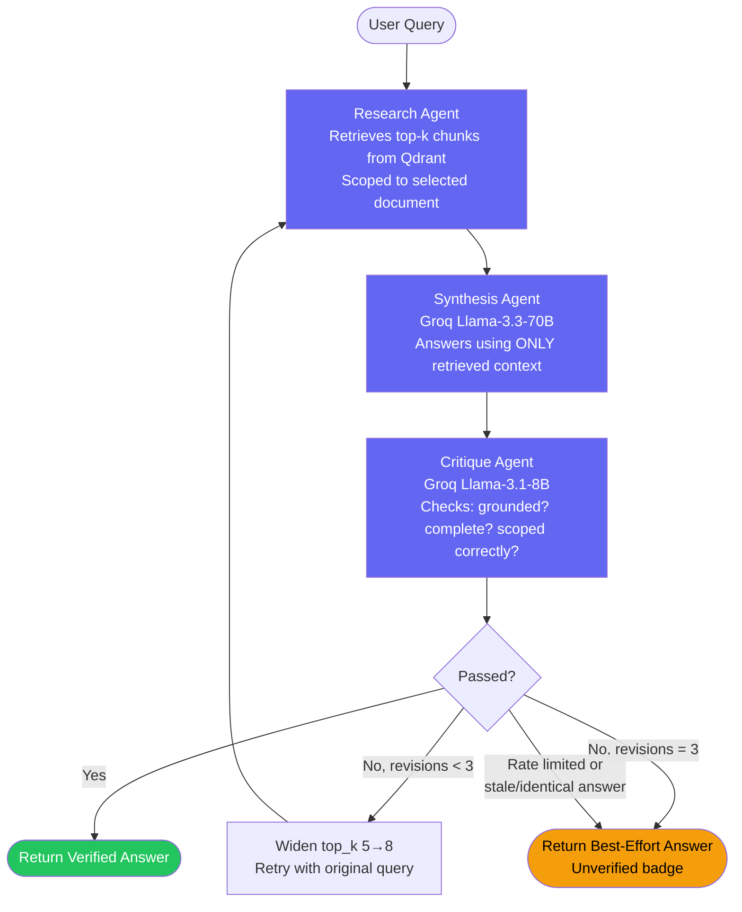

# Multi-Agent RAG Research Assistant

A production-grade, multi-agent Retrieval-Augmented Generation system that ingests PDFs, answers questions with cited sources, and self-corrects low-quality answers through an automated critique-and-retry loop — evaluated end-to-end with RAGAS and deployed live.

**Live demo:** https://multi-agent-rag-research-assistant.vercel.app
**Backend API docs:** https://9raveen-multi-agent-rag-research-assistant-api.hf.space/docs

---

## Table of Contents

- [Problem Statement](#problem-statement)
- [Architecture](#architecture)
- [Tech Stack](#tech-stack)
- [Key Engineering Decisions](#key-engineering-decisions)
- [Evaluation Results (RAGAS)](#evaluation-results-ragas)
- [Real Bugs Found & Fixed](#real-bugs-found--fixed)
- [Deployment Journey](#deployment-journey)
- [UI Features](#ui-features)
- [Project Structure](#project-structure)
- [Running Locally](#running-locally)
- [Future Work](#future-work)

---

## Problem Statement

Upload a PDF, ask any question about it, and get a cited, verified answer — grounded strictly in the document's content, with automatic self-correction when the first-pass answer is incomplete or unsupported.

Target use cases: legal contract review, financial report synthesis, academic literature review, enterprise knowledge bases.

---

## Architecture

The core of the system is a **LangGraph multi-agent pipeline** with a conditional retry loop. Every query flows through three specialized agents, each with a single responsibility:



### Agent Responsibilities

| Agent         | Model                                  | Responsibility                                                                                                               |
| ------------- | -------------------------------------- | ---------------------------------------------------------------------------------------------------------------------------- |
| **Research**  | fastembed (ONNX, local) + Qdrant Cloud | Embeds query, retrieves top-k semantically similar chunks, optionally scoped to a single uploaded document                   |
| **Synthesis** | Groq `llama-3.3-70b-versatile`         | Generates an answer using _only_ the retrieved context — explicitly instructed to say "not found" rather than hallucinate    |
| **Critique**  | Groq `llama-3.1-8b-instant`            | Fact-checks the answer against retrieved context; returns structured JSON (`passed`, `feedback`); routes retry or completion |

### Retry & Safety Logic

The retry loop isn't a naive "try again" — it has three independent safety mechanisms to prevent wasted compute and infinite loops:

1. **Rate-limit short-circuit** — if Groq's API returns a rate-limit error, the pipeline immediately routes to `give_up` rather than retrying into a guaranteed second failure.
2. **Staleness detection** — if synthesis produces an identical answer to the previous attempt, retrying again won't help (only critique's non-deterministic verdict would change), so the pipeline gives up rather than burning another full cycle.
3. **Hard cap** — `MAX_REVISIONS = 3` regardless of the above, guaranteeing bounded latency and cost per query.

---

## Tech Stack

| Layer               | Technology                                             | Why                                                                                                                            |
| ------------------- | ------------------------------------------------------ | ------------------------------------------------------------------------------------------------------------------------------ |
| Agent Orchestration | **LangGraph**                                          | Explicit state machine for the research→synthesis→critique→retry loop                                                          |
| LLM (synthesis)     | **Groq** `llama-3.3-70b-versatile`                     | Fast inference, strong instruction-following for grounded synthesis                                                            |
| LLM (critique)      | **Groq** `llama-3.1-8b-instant`                        | Cheaper/faster for a binary pass/fail classification task — synthesis quality doesn't require 70B-scale reasoning here         |
| Embeddings          | **fastembed** (`BAAI/bge-small-en-v1.5`, ONNX runtime) | No PyTorch dependency — critical for fitting within constrained hosting memory (see [Deployment Journey](#deployment-journey)) |
| Vector Database     | **Qdrant Cloud**                                       | Managed, filterable vector search with payload indexing for document-scoped retrieval                                          |
| Backend             | **FastAPI**                                            | Async-friendly, auto-generated OpenAPI docs, clean Pydantic validation                                                         |
| Frontend            | **React (Vite)**                                       | Fast dev loop, no unnecessary framework overhead for this scope                                                                |
| PDF Parsing         | **PyMuPDF (fitz)**                                     | Column-aware reading order, font-size header detection, table-aware extraction                                                 |
| Evaluation          | **RAGAS**                                              | Industry-standard RAG metrics: faithfulness, answer relevancy, context precision/recall                                        |
| Backend Hosting     | **Hugging Face Spaces** (Docker)                       | See migration story below                                                                                                      |
| Frontend Hosting    | **Vercel**                                             | Zero-config Vite deploys                                                                                                       |

---

## Key Engineering Decisions

### 1. Document-Scoped Retrieval (Contamination Prevention)

Early testing surfaced a real bug: with multiple PDFs in one Qdrant collection, an unrelated query could silently retrieve chunks from the _wrong_ document — producing a plausible-looking but contaminated answer (real citations, real page numbers, wrong source). This is worse than an obvious hallucination because it's harder to catch.

**Fix:** every query can be scoped to a single `source_file` via a Qdrant payload filter (`FieldCondition` + `MatchValue`), with an explicit payload index (`create_payload_index`) required for Qdrant Cloud to support the filter efficiently.

### 2. Table-Aware Ingestion

PDF tables are detected via PyMuPDF's `find_tables()`, serialized to Markdown (not flattened prose), and chunked separately from surrounding text — with a `min_rows` threshold to reject false-positive single-row detections common in slide-deck PDFs. Multi-page table continuations (a table ending near a page bottom, continuing headerless on the next page) are detected and merged into one logical table.

### 3. Deterministic Point IDs

Qdrant point IDs are derived via `md5(chunk_id) → UUID` rather than `uuid.uuid4()`. This makes re-ingesting the same PDF idempotent — re-running ingestion overwrites existing vectors instead of silently accumulating duplicates (a real bug caught during development).

### 4. Batched Embedding + Upload

Embedding and uploading all chunks from a document in a single batch caused out-of-memory crashes on larger PDFs once deployed to a memory-constrained host. Fixed by processing chunks in small batches (4–8 at a time) with explicit garbage collection between batches, bounding peak memory regardless of document size.

---

## Evaluation Results (RAGAS)

Benchmarked against a 10-question set spanning single-hop factual questions, multi-hop comparative questions, and negative/out-of-scope questions (to verify the system correctly refuses to answer when information isn't present — directly testing the contamination-prevention fix above).

**Baseline run (8/10 scoreable; 2 excluded due to Groq API rate-limiting, not pipeline failure):**

| Metric            | Score      |
| ----------------- | ---------- |
| Faithfulness      | **0.9542** |
| Answer Relevancy  | **0.7951** |
| Context Precision | **0.7238** |
| Context Recall    | **1.0000** |

**Methodology notes:**

- Judge LLM: Groq `llama-3.1-8b-instant` via OpenAI-compatible endpoint (workaround for a confirmed upstream `ragas` provider-dispatch bug — see below)
- Embeddings for judge: local `sentence-transformers` (evaluation-only; not used in the live serving path)
- Questions that failed due to infrastructure issues (API rate limits) are explicitly excluded from scoring and reported separately — conflating infrastructure failure with retrieval/synthesis quality would misrepresent the pipeline's actual performance

---

## Real Bugs Found & Fixed

This project surfaced several genuine bugs — in the codebase, in third-party libraries, and in infrastructure — each diagnosed and fixed rather than worked around superficially.

| Bug                                                                                                        | Diagnosis                                                                                                                                                           | Fix                                                                                                                                                                  |
| ---------------------------------------------------------------------------------------------------------- | ------------------------------------------------------------------------------------------------------------------------------------------------------------------- | -------------------------------------------------------------------------------------------------------------------------------------------------------------------- |
| **Cross-document contamination**                                                                           | Querying one document silently retrieved chunks from an unrelated document in the same collection                                                                   | Added `document_scope` filtering end-to-end (state → API → retriever → Qdrant payload filter)                                                                        |
| **Duplicate Qdrant points on re-ingestion**                                                                | Random `uuid.uuid4()` point IDs meant every re-run created new points instead of overwriting                                                                        | Deterministic point IDs via `md5(chunk_id)`                                                                                                                          |
| **`ragas` import crash** ([upstream issue #2741](https://github.com/explodinggradients/ragas/issues/2741)) | `ragas.llms.base` unconditionally imports `ChatVertexAI` from a module removed in `langchain_community 0.4.x`                                                       | Injected a stub module into `sys.modules` before importing `ragas`                                                                                                   |
| **`ragas` Groq provider bug**                                                                              | `ragas`'s `"groq"` provider branch incorrectly assumes an Anthropic-shaped client (`client.messages.create`)                                                        | Routed through the OpenAI-compatible provider branch, pointed at Groq's OpenAI-compatible endpoint                                                                   |
| **Retry loop cascading into rate limits**                                                                  | A single question hitting a rate limit would retry up to 3× into the _same_ guaranteed failure, needlessly amplifying quota exhaustion                              | Added a `rate_limited` state flag that short-circuits directly to `give_up`, skipping retry                                                                          |
| **Non-deterministic critique causing wasted retries**                                                      | Even at `temperature=0.0`, Groq's hosted inference isn't fully deterministic — identical synthesis output could receive different critique verdicts across attempts | Added staleness detection: if synthesis produces an unchanged answer, stop retrying rather than gambling on critique noise                                           |
| **Qdrant Cloud filter requires explicit index**                                                            | `query_points()` with a `Filter` on `source_file` returned `400 Bad Request` on Qdrant Cloud (worked locally)                                                       | Added `create_payload_index()` (idempotent) during collection setup                                                                                                  |
| **Render OOM on document upload**                                                                          | PyTorch-backed `sentence-transformers`, loaded twice (once per module), exceeded Render's 512MB free-tier ceiling                                                   | Migrated to `fastembed` (ONNX runtime, no PyTorch dependency), deduplicated to a single lazy-loaded shared instance, batched embedding+upload — see full story below |

---

## Deployment Journey

The deployment phase surfaced a genuine infrastructure constraint worth documenting as an engineering decision, not just a debugging log.

1. **Initial deploy target: Render (free tier, 512MB RAM).** The app repeatedly hit out-of-memory crashes on document upload, confirmed via Render's own OOM detector emails.
2. **Root-caused to:** `sentence-transformers`' PyTorch backend, loaded redundantly across two modules (`embedder.py` and `retriever.py`), each instantiating its own model instance.
3. **First fix — deduplicate the model load** to a single lazy-loaded singleton shared across modules. Reduced but did not eliminate OOM on larger documents.
4. **Second fix — batch the embed+upload step** so peak memory scales with batch size, not total document size.
5. **Third fix — migrate the embedding library from `sentence-transformers` to `fastembed`**, which uses ONNX Runtime instead of full PyTorch — removing the heaviest dependency in the stack entirely.
6. **Even after all three fixes, Render's 512MB ceiling remained too tight** for the combined footprint of FastAPI + LangGraph + Groq/OpenAI SDKs + fastembed under real document-processing load.
7. **Final fix — migrated backend hosting to Hugging Face Spaces** (Docker SDK), which provides substantially more RAM on its free tier. Combined with the fastembed migration and a startup-time model preload (so the embedding model loads once during boot, not mid-request), this fully resolved the memory constraint.

This is presented as a resolved engineering tradeoff: **correct code can still fail under a hard resource ceiling**, and recognizing when to optimize further versus when to change infrastructure is itself a deployment decision worth making deliberately.

---

## UI Features

Beyond the standard upload/query/answer flow, the frontend surfaces the multi-agent system's internal behavior directly, rather than hiding it behind a single answer box:

- **Agent Pipeline Trace Panel** — shows each node (Research → Synthesis → Critique) as it executes for a given query, including retry cycles, chunks retrieved, and the critique agent's actual pass/fail reasoning. Built by switching the LangGraph execution from `.invoke()` (final-state only) to `.stream()` (per-node state), with a cumulative-state merge to correctly track `revision_count` and `rate_limited` across the whole trace.
- **RAGAS Evaluation Dashboard** — reads the most recent saved evaluation run and renders faithfulness / answer relevancy / context precision / context recall as live progress bars, directly in the app — turning an offline benchmark into a visible, demoable claim rather than a README bullet point.
- **Verified / Best-Effort Badging** — every answer is tagged based on whether it passed critique, so the UI never silently presents an unverified answer as authoritative.
- **Document Scope Indicator** — explicitly shows which uploaded document a query is scoped to, reinforcing the contamination-prevention design.

---

## Project Structure

```
backend/
├── agents/
│   ├── state.py              # Shared LangGraph state schema
│   ├── research_agent.py     # Retrieval node
│   ├── synthesis_agent.py    # Answer generation node
│   ├── critique_agent.py     # Fact-checking node
│   └── graph.py               # LangGraph wiring + retry routing logic
├── api/
│   ├── main.py                 # FastAPI app, CORS, startup model preload
│   ├── routes_query.py        # POST /query
│   ├── routes_upload.py       # POST /upload
│   ├── routes_evaluation.py   # GET /evaluation/latest
│   └── schemas.py              # Pydantic request/response models
├── ingestion/
│   ├── pdf_parser.py          # PyMuPDF extraction, table detection, header detection
│   ├── chunker.py               # Table-aware chunking
│   └── embedder.py              # Batched embed + upload to Qdrant
├── retrieval/
│   ├── embedding_model.py     # Lazy-loaded shared fastembed instance
│   └── retriever.py             # Qdrant query + document scoping
├── evaluation/
│   ├── benchmark_dataset.py   # RAGAS question set
│   ├── run_evaluation.py      # Pipeline runner + RAGAS scoring
│   └── results/                  # Saved scores + raw results (timestamped)
└── Dockerfile                  # HF Spaces deployment

frontend/
├── src/
│   ├── App.jsx
│   ├── api.js                          # Centralized API calls
│   └── components/
│       ├── UploadPanel.jsx
│       ├── QueryPanel.jsx
│       ├── AnswerCard.jsx
│       ├── AgentTracePanel.jsx     # Live pipeline trace visualization
│       └── EvaluationDashboard.jsx  # RAGAS scores display
└── vercel.json                       # SPA rewrite rules
```

---

## Running Locally

**Backend:**

```bash
cd backend
pip install -r requirements.txt

# .env
GROQ_API_KEY=...
QDRANT_URL=...
QDRANT_API_KEY=...

uvicorn api.main:app --reload
```

**Frontend:**

```bash
cd frontend
npm install

# .env
VITE_API_BASE_URL=http://localhost:8000

npm run dev
```

**Run evaluation:**

```bash
cd backend
python evaluation/run_evaluation.py "your-document.pdf"
```

---

## Future Work

Documented as deliberate scope decisions, not oversights:

- **Streaming token responses** (SSE/WebSocket) — would improve perceived latency but requires meaningful FastAPI + frontend architecture changes
- **Multi-document reasoning** — cross-document synthesis queries; currently the system deliberately _prevents_ cross-document mixing (see contamination fix), so enabling this safely would need an explicit, opt-in multi-scope mode
- **Conversation memory** — multi-turn follow-up queries with history-aware query rewriting
- **Provider fallback chain** — same-provider tiered fallback (e.g. Groq 70B → Groq 8B) is safer and more defensible than cross-provider fallback given confirmed regional API restrictions encountered during development
- **Table-lookup benchmark coverage** — table-aware chunking is implemented and tested on a synthetic multi-page table PDF, but not yet included in the RAGAS benchmark set for the primary demo document (which contains no tables)
- **Scaling the benchmark set** from 10 toward ~100 questions, batched across multiple days to respect API rate limits
