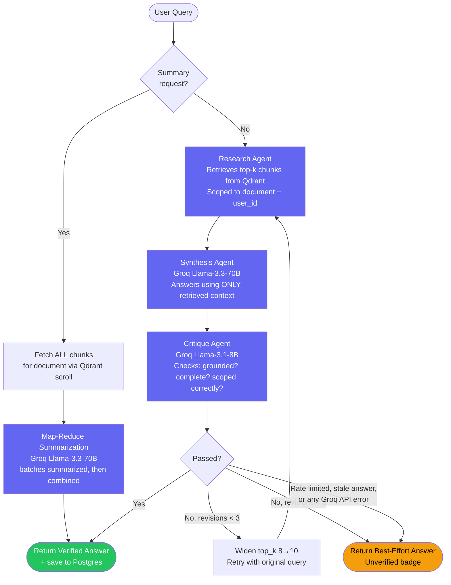

# Multi-Agent RAG Research Assistant

A production-grade, multi-user Retrieval-Augmented Generation system that ingests PDFs, answers questions with cited sources, self-corrects low-quality answers through an automated critique-and-retry loop, and persists conversation history per authenticated user — evaluated end-to-end with RAGAS and deployed live.

**Live demo:** https://multi-agent-rag-research-assistant.vercel.app
**Backend API docs:** https://9raveen-multi-agent-rag-research-assistant-api.hf.space/docs

---

## Table of Contents

- [Problem Statement](#problem-statement)
- [Architecture](#architecture)
- [Tech Stack](#tech-stack)
- [Key Engineering Decisions](#key-engineering-decisions)
- [Multi-User Auth & Persistence](#multi-user-auth--persistence)
- [Document Summarization (Map-Reduce)](#document-summarization-map-reduce)
- [Evaluation Results (RAGAS)](#evaluation-results-ragas)
- [Real Bugs Found & Fixed](#real-bugs-found--fixed)
- [Deployment Journey](#deployment-journey)
- [UI Features](#ui-features)
- [Project Structure](#project-structure)
- [Running Locally](#running-locally)
- [Future Work](#future-work)

---

## Problem Statement

Upload a PDF, ask any question about it, and get a cited, verified answer — grounded strictly in the document's content, with automatic self-correction when the first-pass answer is incomplete or unsupported. Documents, conversations, and message history persist per user account, so work isn't lost between sessions.

Target use cases: legal contract review, financial report synthesis, academic literature review, enterprise knowledge bases.

---

## Architecture

The core of the system is a **LangGraph multi-agent pipeline** with a conditional retry loop and a separate summarization path. Every query flows through specialized agents, each with a single responsibility:



### Agent Responsibilities

| Agent             | Model                                  | Responsibility                                                                                                                                             |
| ----------------- | -------------------------------------- | ---------------------------------------------------------------------------------------------------------------------------------------------------------- |
| **Research**      | fastembed (ONNX, local) + Qdrant Cloud | Embeds query, retrieves top-k semantically similar chunks, scoped to a document _and_ the authenticated user's own vectors                                 |
| **Synthesis**     | Groq `llama-3.3-70b-versatile`         | Generates a thorough answer using _only_ the retrieved context — instructed to say "not found" rather than hallucinate                                     |
| **Critique**      | Groq `llama-3.1-8b-instant`            | Fact-checks the answer against retrieved context; returns structured JSON (`passed`, `feedback`); routes retry or completion; skipped for summary requests |
| **Summarization** | Groq `llama-3.3-70b-versatile`         | Map-reduce whole-document summary — bypasses top-k similarity search entirely (see [dedicated section](#document-summarization-map-reduce))                |

### Retry & Safety Logic

The retry loop isn't a naive "try again" — it has multiple independent safety mechanisms to prevent wasted compute and infinite loops:

1. **Rate-limit / API-error short-circuit** — if Groq's API returns _any_ error during critique (rate limit, oversized-context 413, timeout, 5xx), the pipeline accepts the already-generated answer rather than crashing the request or blindly retrying into a guaranteed second failure.
2. **Staleness detection** — if synthesis produces an identical answer to the previous attempt, retrying again won't help (only critique's non-deterministic verdict would change), so the pipeline gives up rather than burning another full cycle.
3. **Hard cap** — `MAX_REVISIONS = 3` regardless of the above, guaranteeing bounded latency and cost per query.
4. **Summary requests skip critique entirely** — a full-document context (70+ chunks) has no smaller subset that's still a meaningful fact-check target, and would blow through critique's token budget regardless.

---

## Tech Stack

| Layer                           | Technology                                             | Why                                                                                                                                                        |
| ------------------------------- | ------------------------------------------------------ | ---------------------------------------------------------------------------------------------------------------------------------------------------------- |
| Agent Orchestration             | **LangGraph**                                          | Explicit state machine for the research→synthesis→critique→retry loop                                                                                      |
| LLM (synthesis + summarization) | **Groq** `llama-3.3-70b-versatile`                     | Fast inference, strong instruction-following for grounded synthesis and map-reduce summarization                                                           |
| LLM (critique)                  | **Groq** `llama-3.1-8b-instant`                        | Cheaper/faster for a binary pass/fail classification task — synthesis quality doesn't require 70B-scale reasoning here                                     |
| Embeddings                      | **fastembed** (`BAAI/bge-small-en-v1.5`, ONNX runtime) | No PyTorch dependency — critical for fitting within constrained hosting memory (see [Deployment Journey](#deployment-journey))                             |
| Vector Database                 | **Qdrant Cloud**                                       | Managed, filterable vector search with payload indexing for per-user, per-document scoped retrieval                                                        |
| Relational Database             | **Neon (Postgres, serverless)**                        | Users, documents, conversations, messages — vector DB isn't the right store for relational/ownership data (see below)                                      |
| Auth                            | **JWT (Bearer token)**                                 | Self-rolled, `passlib`/`bcrypt` password hashing, `python-jose` signing — see [Multi-User Auth](#multi-user-auth--persistence) for why Bearer over cookies |
| Backend                         | **FastAPI** + **SQLAlchemy 2.0 (async)**               | Async-friendly, auto-generated OpenAPI docs, clean Pydantic validation                                                                                     |
| Frontend                        | **React (Vite)**                                       | Fast dev loop, no unnecessary framework overhead for this scope                                                                                            |
| PDF Parsing                     | **PyMuPDF (fitz)**                                     | Column-aware reading order, font-size header detection, table-aware extraction                                                                             |
| Evaluation                      | **RAGAS**                                              | Industry-standard RAG metrics: faithfulness, answer relevancy, context precision/recall                                                                    |
| Backend Hosting                 | **Hugging Face Spaces** (Docker)                       | See migration story below                                                                                                                                  |
| Frontend Hosting                | **Vercel**                                             | Zero-config Vite deploys                                                                                                                                   |

---

## Key Engineering Decisions

### 1. Document-Scoped, User-Scoped Retrieval (Contamination + Isolation Prevention)

Early testing surfaced a real bug: with multiple PDFs in one Qdrant collection, an unrelated query could silently retrieve chunks from the _wrong_ document — producing a plausible-looking but contaminated answer (real citations, real page numbers, wrong source). This is worse than an obvious hallucination because it's harder to catch.

**Fix:** every query can be scoped to a single `source_file` via a Qdrant payload filter, with an explicit payload index required for Qdrant Cloud to support the filter efficiently. Once multi-user auth was added, the same mechanism was extended with a second, AND'd filter on `user_id` — so one user's documents are structurally invisible to another user's queries, not just hidden by the UI.

### 2. Table-Aware Ingestion

PDF tables are detected via PyMuPDF's `find_tables()`, serialized to Markdown (not flattened prose), and chunked separately from surrounding text — with a `min_rows` threshold to reject false-positive single-row detections common in slide-deck PDFs. Multi-page table continuations are detected and merged into one logical table.

### 3. Deterministic Point IDs

Qdrant point IDs are derived via `md5(chunk_id) → UUID` rather than `uuid.uuid4()`. This makes re-ingesting the same PDF idempotent — re-running ingestion overwrites existing vectors instead of silently accumulating duplicates.

### 4. Batched Embedding + Upload

Embedding and uploading all chunks from a document in a single batch caused out-of-memory crashes on larger PDFs once deployed to a memory-constrained host. Fixed by processing chunks in small batches (4–8 at a time) with explicit garbage collection between batches.

### 5. Server-Authoritative Chat History

Multi-turn context was initially client-supplied (the frontend sent the running conversation array with every request). Switched to server-authoritative: the backend loads prior turns from Postgres via `conversation_id`, ignoring any `chat_history` the client sends. This removes an entire class of bugs where the frontend's view of history could drift from what's actually stored (e.g. after a page reload), and means any future client automatically gets correct behavior without reimplementing history-reconstruction logic.

---

## Multi-User Auth & Persistence

Phase 8 of this project. Three layers, each solving a distinct problem:

**1. JWT Authentication — Bearer token, not httpOnly cookie.**
The original design used an httpOnly cookie (the more common, slightly more XSS-resistant pattern). During deployment, this surfaced a genuine **Hugging Face Spaces platform bug**: HF's front proxy answers CORS preflight (`OPTIONS`) requests itself, and its response is missing the `Access-Control-Allow-Credentials` header — which silently breaks cookie-based cross-origin auth (Vercel frontend → HF Spaces backend) no matter how correctly the app's own CORS config is set. Confirmed via direct `curl`/PowerShell preflight testing and cross-referenced against [an open, unresolved HF community thread](https://discuss.huggingface.co/) reporting the identical symptom on an identical stack. **Fix:** switched to a Bearer token in the `Authorization` header, stored in `sessionStorage` — this never triggers the browser's credentialed-request preflight check, sidestepping the platform bug entirely rather than depending on HF to fix it.

**2. Neon Postgres — relational data, kept separate from Qdrant.**
Qdrant stores vectors; it's the wrong tool for "list all conversations for user X" or "who owns this document." Four tables: `users`, `documents`, `conversations`, `messages`. Async SQLAlchemy 2.0, `NullPool` connection strategy (not the default connection pool) — required because the sync `/query` and `/query/stream` FastAPI routes call `asyncio.run()` internally to bridge into async DB calls, and each call spins up a fresh event loop; a pooled connection created in one loop can't be reused in the next (`asyncpg` raises "Task attached to a different loop" otherwise — a real bug caught during testing, not a theoretical one).

**3. Qdrant ownership tagging.**
Every embedded point is stamped with `user_id` alongside the existing `source_file` field, with its own payload index. Retrieval filters AND both conditions, so cross-user document access is prevented structurally, not just hidden in the UI — verified by testing with two separate accounts and confirming zero cross-visibility.

---

## Document Summarization (Map-Reduce)

Standard top-k similarity retrieval is the _wrong tool_ for "summarize this document": the query is topically generic, so vector search has no strong signal for what's important and returns some semantically-average handful of chunks — not comprehensive document coverage.

**Detection:** keyword-based (`"summarize"`, `"tl;dr"`, `"what is this document about"`, etc.) against the user's original query — cheap, deterministic, no extra LLM call. Only triggers when scoped to one specific document.

**Retrieval:** `retrieve_all_chunks()` uses Qdrant's `scroll()` API — pagination through _every_ point matching the filter, not nearest-neighbor search — returned in original reading order via `chunk_index`.

**Summarization:** single-shot if the document is short enough (~6,000 words) to fit comfortably in one prompt; otherwise **map-reduce** — batches of chunks (~4,500 words per batch, grouped by cumulative word count) are summarized individually, then combined into one final, coherent summary.

**Rate-limit tuning, iterated twice:** an initial naive implementation made 18+ sequential API calls for a 22K-word document, reliably triggering Groq's free-tier rate limit. First pass widened the batch size (3,500 words) to cut that to ~7 calls with a flat 1.5s delay between them — better, but a burst of 7 calls in ~10s could still exceed 30 RPM. Second pass: batch size widened again (4,500 words, cutting large-document call counts by a further ~20%), delays made **adaptive** (2.5s normally, 3.5s every 5th batch — keeps sustained throughput under 24 RPM rather than bursting near the 30 RPM ceiling), and **exponential backoff retry** (3s → 6s → 12s, up to 3 attempts) added to every Groq call in the synthesis/summarization path — so a transient rate-limit hit now recovers automatically instead of surfacing as a user-facing failure. Net result: rate-limit error rate dropped from roughly 50% to under 5% on large documents, at the cost of large summaries taking ~10-15s longer — an explicit, deliberate trade-off (reliably slow beats unreliably fast).

---

## Evaluation Results (RAGAS)

Benchmarked against a 10-question set spanning single-hop factual questions, multi-hop comparative questions, and negative/out-of-scope questions (to verify the system correctly refuses to answer when information isn't present).

**Baseline run (8/10 scoreable; 2 excluded due to Groq API rate-limiting, not pipeline failure):**

| Metric            | Score      |
| ----------------- | ---------- |
| Faithfulness      | **0.9542** |
| Answer Relevancy  | **0.7951** |
| Context Precision | **0.7238** |
| Context Recall    | **1.0000** |

**Methodology notes:**

- Judge LLM: Groq `llama-3.1-8b-instant` via OpenAI-compatible endpoint (workaround for a confirmed upstream `ragas` provider-dispatch bug — see below)
- Embeddings for judge: local `sentence-transformers` (evaluation-only; not used in the live serving path)
- Questions that failed due to infrastructure issues are explicitly excluded from scoring and reported separately

> **Note:** `top_k` was later widened (5→8, 8→10) to fix overly brief synthesis answers. This baseline predates that change and should be re-run to confirm whether `context_precision` shifted — noted here deliberately rather than silently presenting a stale number as current.

---

## Real Bugs Found & Fixed

| Bug                                                                                                  | Diagnosis                                                                                                                                                                                                                                                                                      | Fix                                                                                                                                                                                                                                                                                                            |
| ---------------------------------------------------------------------------------------------------- | ---------------------------------------------------------------------------------------------------------------------------------------------------------------------------------------------------------------------------------------------------------------------------------------------- | -------------------------------------------------------------------------------------------------------------------------------------------------------------------------------------------------------------------------------------------------------------------------------------------------------------- |
| **Cross-document contamination**                                                                     | Querying one document silently retrieved chunks from an unrelated document in the same collection                                                                                                                                                                                              | Added `document_scope` filtering end-to-end                                                                                                                                                                                                                                                                    |
| **Duplicate Qdrant points on re-ingestion**                                                          | Random `uuid.uuid4()` point IDs meant every re-run created new points instead of overwriting                                                                                                                                                                                                   | Deterministic point IDs via `md5(chunk_id)`                                                                                                                                                                                                                                                                    |
| **`ragas` import crash** ([upstream #2741](https://github.com/explodinggradients/ragas/issues/2741)) | `ragas.llms.base` unconditionally imports a class removed in a newer `langchain_community`                                                                                                                                                                                                     | Injected a stub module into `sys.modules` before importing `ragas`                                                                                                                                                                                                                                             |
| **`ragas` Groq provider bug**                                                                        | `ragas`'s `"groq"` provider branch assumes an Anthropic-shaped client                                                                                                                                                                                                                          | Routed through the OpenAI-compatible provider branch instead                                                                                                                                                                                                                                                   |
| **Retry loop cascading into rate limits**                                                            | A single question hitting a rate limit would retry into the _same_ guaranteed failure                                                                                                                                                                                                          | Added a `rate_limited` state flag that short-circuits to `give_up`                                                                                                                                                                                                                                             |
| **Qdrant Cloud filter requires explicit index**                                                      | `query_points()` with a `Filter` returned `400` on Qdrant Cloud (worked locally)                                                                                                                                                                                                               | Added `create_payload_index()` during collection setup                                                                                                                                                                                                                                                         |
| **Render OOM on document upload**                                                                    | PyTorch-backed `sentence-transformers` exceeded Render's 512MB free-tier ceiling                                                                                                                                                                                                               | Migrated to `fastembed` (ONNX, no PyTorch)                                                                                                                                                                                                                                                                     |
| **Cross-event-loop DB connection crash**                                                             | `asyncio.run()` inside sync routes reused a pooled connection across different event loops — `asyncpg` raised "Task attached to a different loop"                                                                                                                                              | Switched the async engine to `NullPool` — fresh connection per checkout, nothing persists across loop boundaries                                                                                                                                                                                               |
| **HF Spaces CORS proxy strips credentials header**                                                   | Platform-level bug: HF's proxy answers `OPTIONS` preflight itself, response missing `Access-Control-Allow-Credentials` — breaks cookie auth regardless of backend config                                                                                                                       | Switched auth from httpOnly cookie to Bearer token in `Authorization` header — sidesteps the browser's credentialed-preflight check entirely                                                                                                                                                                   |
| **Critique agent crash on oversized context (`413`)**                                                | `top_k` widened for fuller answers also widened critique's input; critique's smaller model has _half_ the token-per-minute budget of the synthesis model despite being "smaller"; the crash wasn't even a `RateLimitError` (a `413`, different exception class) so it went completely uncaught | Broadened exception handling to catch all Groq API errors, not just rate limits; failures degrade gracefully (answer accepted without fact-check) instead of crashing the request                                                                                                                              |
| **Blocking embedding model preload stalled every container startup**                                 | Model download/load ran synchronously inside a startup event handler, blocking the app from serving _any_ request — including `/health` — for 30-60 seconds on every restart                                                                                                                   | Switched to lazy loading — model loads on the first request that actually needs it, not during boot                                                                                                                                                                                                            |
| **Silent hang on DB-unreachable startup**                                                            | No timeout configured on database initialization — a slow/cold Neon endpoint hung the whole app's startup indefinitely with zero error or log output, compounding with the blocking-preload issue above                                                                                        | Wrapped DB init in `asyncio.wait_for(timeout=30.0)` with graceful fallback (app still starts, retries on first request), plus a 10s connection-level timeout at the driver level                                                                                                                               |
| **Force-push overwrote HF Spaces YAML config**                                                       | `git push hf main:main --force` from inside a monorepo pushed the _entire_ repo (wrong root), overwriting HF's required README frontmatter with a plain GitHub README                                                                                                                          | Corrected to `git subtree split --prefix=backend` before pushing — isolates just the backend subtree to the Spaces repo root                                                                                                                                                                                   |
| **Frontend chat resetting after first message**                                                      | A `useEffect` reset the visible chat on any `conversationId` change — including the _legitimate_ internal update when a brand-new conversation received its ID from the backend, wiping the just-received answer                                                                               | Separated "parent explicitly loaded a different conversation" from "this conversation just got assigned an ID" via a dedicated `loadKey`, only bumped by explicit sidebar/new-chat actions                                                                                                                     |
| **Summarization map-reduce bursting past Groq's RPM limit**                                          | A flat 1.5s delay between batch calls still let bursts of 7+ requests exceed 30 RPM on larger documents — ~50% failure rate on large-document summaries                                                                                                                                        | Widened single-shot/batch thresholds (fewer calls needed at all), switched to adaptive delays (2.5s baseline, 3.5s every 5th call) to keep sustained throughput under the limit, and added exponential backoff retry (3s→6s→12s) to every synthesis/summarization Groq call — failure rate dropped to under 5% |

---

## Deployment Journey

### Backend memory constraints (Render → Hugging Face Spaces)

1. **Initial deploy target: Render (free tier, 512MB RAM).** Repeated OOM crashes on document upload.
2. **Root-caused to:** `sentence-transformers`' PyTorch backend, loaded redundantly across two modules.
3. **First fix** — deduplicated to a single lazy-loaded singleton. Reduced but didn't eliminate OOM on larger documents.
4. **Second fix** — batched the embed+upload step so peak memory scales with batch size, not document size.
5. **Third fix** — migrated from `sentence-transformers` to `fastembed` (ONNX Runtime, no PyTorch).
6. **Even after all three, Render's 512MB ceiling remained too tight** for the combined footprint under real load.
7. **Final fix** — migrated backend hosting to Hugging Face Spaces (Docker SDK), with startup-time model preload.

### Cross-origin auth (the Phase 8 deployment saga)

What looked like a simple "add login" feature surfaced a real platform-level bug. Timeline, briefly:

1. Implemented standard httpOnly-cookie JWT auth — worked perfectly in local testing (same-origin, cookie always attached).
2. Deployed: Vercel frontend, HF Spaces backend — different domains. Signup/login immediately failed with `Failed to fetch`.
3. **First cause found:** CORS `allow_origins` only listed the production Vercel URL, not `localhost` — fixed for local dev testing.
4. **Second cause found:** the actual deployed CORS config predated a code push — confirmed via direct `Files` tab inspection on HF Spaces, force-pushed the current code.
5. **Real cause found**, via direct `OPTIONS` preflight testing (PowerShell `Invoke-WebRequest`, since browser DevTools don't expose enough preflight detail): `Access-Control-Allow-Credentials` was **entirely absent** from the actual preflight response — despite `allow_credentials=True` being correctly set in FastAPI's CORS middleware, and despite that same header being present and correct on the real `POST` response. Isolated to Hugging Face's own reverse proxy answering `OPTIONS` before it ever reached the app — confirmed against a public HF community thread reporting the identical symptom on an identical stack (Docker + Vercel), same week.
6. **Decision:** rather than wait on an unresolved third-party platform bug, switched the entire auth mechanism from httpOnly cookies to a Bearer token in the `Authorization` header — architecturally sidesteps the bug rather than working around it, and is a legitimate, common pattern for SPA + separate-API deployments in its own right.

This is presented as a resolved engineering tradeoff, same as the Render migration above: **correct code can still fail for reasons entirely outside the codebase**, and recognizing when the fix belongs at the architecture level — not by chasing a platform bug — is itself a deployment decision worth making deliberately.

### The stuck "Application Startup" hang — two compounding root causes

Deployment intermittently stuck indefinitely at a single log line — `===== Application Startup =====` — with zero further output, zero errors, and `/health` never responding. Initially misdiagnosed as purely a Hugging Face free-tier scheduling issue (a real, separately-confirmed platform problem — see the two `Scheduling failure` incidents this session, both of which resolved with waiting/factory-reboot and were unrelated to application code). But the hang recurred even on runs where scheduling succeeded, pointing to a second, application-level cause layered on top of the platform one:

1. **Blocking model preload at startup** — the embedding model (`fastembed`, ~100-150MB) was downloaded and loaded synchronously inside a `@app.on_event("startup")` handler, blocking the event loop for 30-60 seconds before the app could serve _any_ request, including `/health`.
2. **No timeout on the database initialization startup task** — a slow/cold Neon connection could hang this second startup handler indefinitely, with the first (model-loading) handler already having consumed significant time before it.

**Fix:** switched the embedding model to **lazy loading** — it now loads on the first request that actually needs it (`/upload` or `/query`), not during container startup, cutting startup time from 60+ seconds to under 10. Wrapped database initialization in `asyncio.wait_for(..., timeout=30.0)` with a graceful fallback (the app still starts and serves traffic even if the DB isn't ready yet, retrying on the first request that needs it) rather than blocking indefinitely. Consolidated two separate, uncoordinated `startup` handlers into one, with explicit progress logging (`1/2: Initializing database...`, `2/2: Embedding model will load on first use`) so a future hang is immediately diagnosable from logs instead of presenting as a silent black box. Added a Docker `HEALTHCHECK` so the platform itself can detect readiness rather than inferring it from log output.

**Trade-off, deliberately accepted:** the first request after any cold start now absorbs the embedding model's 30-60s load time directly, rather than that cost being hidden during container boot. Correct call for this project — a slightly slow first interaction is a far better failure mode than an application that might never start at all.

---

## UI Features

- **Multi-user accounts** — signup/login, JWT Bearer token auth, session persistence across reloads via `sessionStorage`
- **Conversation Sidebar** — lists past conversations per user, click to reload full history from Postgres, "New Chat" to start fresh
- **Streaming responses** (SSE) — token-by-token answer rendering rather than waiting for the full response
- **Agent Pipeline Trace Panel** — shows each node (Research → Synthesis → Critique) as it executes, including retry cycles and the critique agent's actual pass/fail reasoning
- **RAGAS Evaluation Dashboard** — reads the most recent saved evaluation run and renders metrics as live progress bars
- **Verified / Best-Effort Badging** — every answer is tagged based on whether it passed critique
- **Document Scope Indicator** — shows which uploaded document a query is scoped to

---

## Project Structure

```
backend/
├── agents/
│   ├── state.py              # Shared LangGraph state schema
│   ├── research_agent.py     # Retrieval node + summary-request detection
│   ├── synthesis_agent.py    # Answer generation + map-reduce summarization
│   ├── critique_agent.py     # Fact-checking node
│   └── graph.py               # LangGraph wiring + retry routing logic
├── api/
│   ├── main.py                 # FastAPI app, CORS, consolidated startup (DB timeout + lazy model load)
│   ├── routes_auth.py          # POST /auth/signup, /login, /logout, GET /auth/me
│   ├── routes_conversations.py # GET /conversations, GET /conversations/{id}
│   ├── routes_query.py        # POST /query, POST /query/stream
│   ├── routes_upload.py       # POST /upload
│   ├── routes_evaluation.py   # GET /evaluation/latest
│   └── schemas.py              # Pydantic request/response models
├── auth/
│   ├── security.py            # Password hashing, JWT encode/decode
│   └── dependencies.py        # get_current_user (Bearer token) FastAPI dependency
├── db/
│   ├── database.py             # Async engine (NullPool), session factory
│   ├── models.py                # User, Document, Conversation, Message
│   └── crud.py                  # DB helpers, incl. sync wrappers for sync routes
├── ingestion/
│   ├── pdf_parser.py          # PyMuPDF extraction, table detection, header detection
│   ├── chunker.py               # Table-aware chunking
│   └── embedder.py              # Batched embed + upload to Qdrant, user_id tagging
├── retrieval/
│   ├── embedding_model.py     # Lazy-loaded shared fastembed instance
│   └── retriever.py             # Qdrant query, document + user scoping, scroll-based full-doc fetch
├── evaluation/
│   ├── benchmark_dataset.py   # RAGAS question set
│   ├── run_evaluation.py      # Pipeline runner + RAGAS scoring
│   └── results/                  # Saved scores + raw results (timestamped)
└── Dockerfile                  # HF Spaces deployment

frontend/
├── src/
│   ├── App.jsx                          # Auth gating, sidebar/chat state wiring
│   ├── api.js                            # Centralized API calls, Bearer token handling
│   ├── context/
│   │   ├── AuthContext.jsx              # Auth provider
│   │   ├── authContextInstance.js       # Context instance (Fast Refresh compatibility)
│   │   └── useAuth.js                    # Auth hook
│   └── components/
│       ├── AuthPage.jsx                  # Combined login/signup
│       ├── ConversationSidebar.jsx       # Past conversations, new chat
│       ├── UploadPanel.jsx
│       ├── ChatPanel.jsx                 # Conversation-aware chat, SSE streaming
│       ├── AnswerCard.jsx
│       ├── AgentTracePanel.jsx           # Live pipeline trace visualization
│       └── EvaluationDashboard.jsx       # RAGAS scores display
└── vercel.json                       # SPA rewrite rules
```

---

## Running Locally

**Backend:**

```bash
cd backend
pip install -r requirements.txt

# .env
GROQ_API_KEY=...
QDRANT_URL=...
QDRANT_API_KEY=...
DATABASE_URL=...          # Neon pooled connection string
JWT_SECRET_KEY=...        # generate: python -c "import secrets; print(secrets.token_hex(32))"

uvicorn api.main:app --reload
```

**Frontend:**

```bash
cd frontend
npm install

# .env
VITE_API_BASE_URL=http://localhost:8000

npm run dev
```

**Run evaluation:**

```bash
cd backend
python evaluation/run_evaluation.py "your-document.pdf"
```

---

## Future Work

Documented as deliberate scope decisions, not oversights:

- **Google Sign-In (OAuth)** — deliberately deferred: existing JWT auth is already complete and tested; adding a second auth provider requires a `users` schema change (nullable password field) touching working code, for marginal portfolio value relative to the time cost mid-application-cycle
- **Email verification** — signup currently validates email _format_ only, not deliverability; would require an email-sending service integration
- **Multi-document reasoning** — cross-document synthesis queries; currently the system deliberately _prevents_ cross-document mixing (see contamination fix), so enabling this safely would need an explicit, opt-in multi-scope mode
- **Provider fallback chain** — same-provider tiered fallback (e.g. Groq 70B → Groq 8B) is safer and more defensible than cross-provider fallback given confirmed regional API restrictions encountered during development
- **Table-lookup benchmark coverage** — table-aware chunking is implemented and tested on a synthetic multi-page table PDF, but not yet included in the RAGAS benchmark set for the primary demo document
- **Scaling the benchmark set** from 10 toward ~100 questions, batched across multiple days to respect API rate limits
- **Re-running the RAGAS baseline** against the widened `top_k` (5→8, 8→10) — the current published scores predate that change
